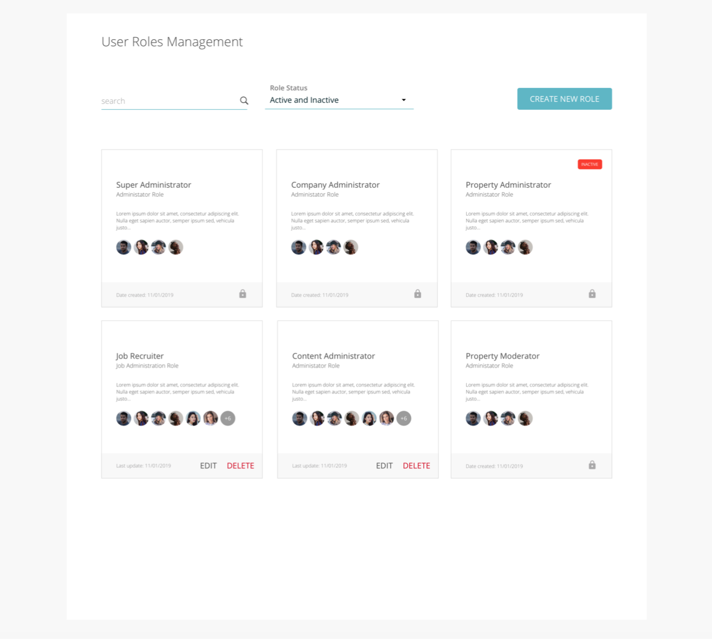
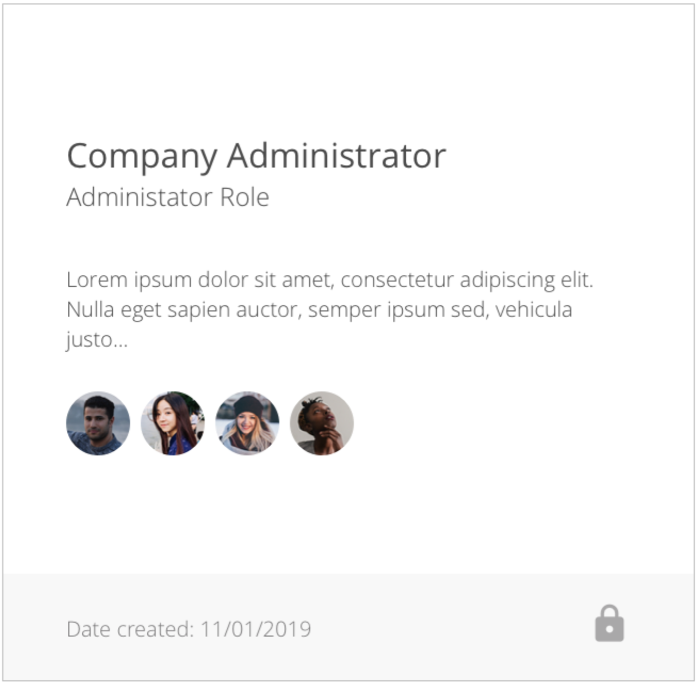
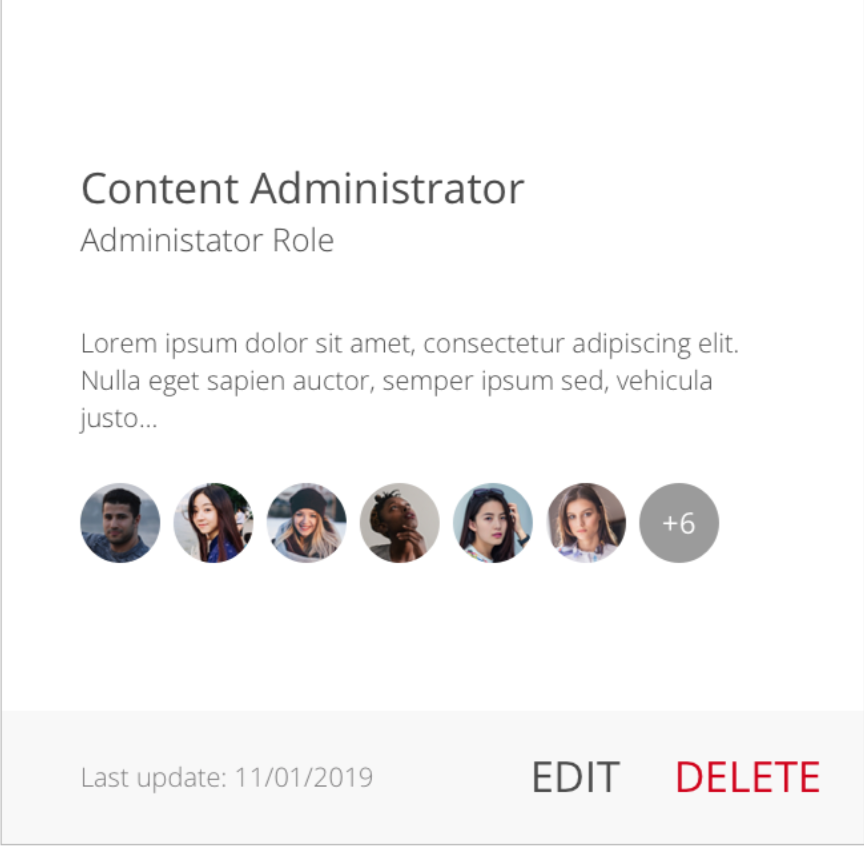
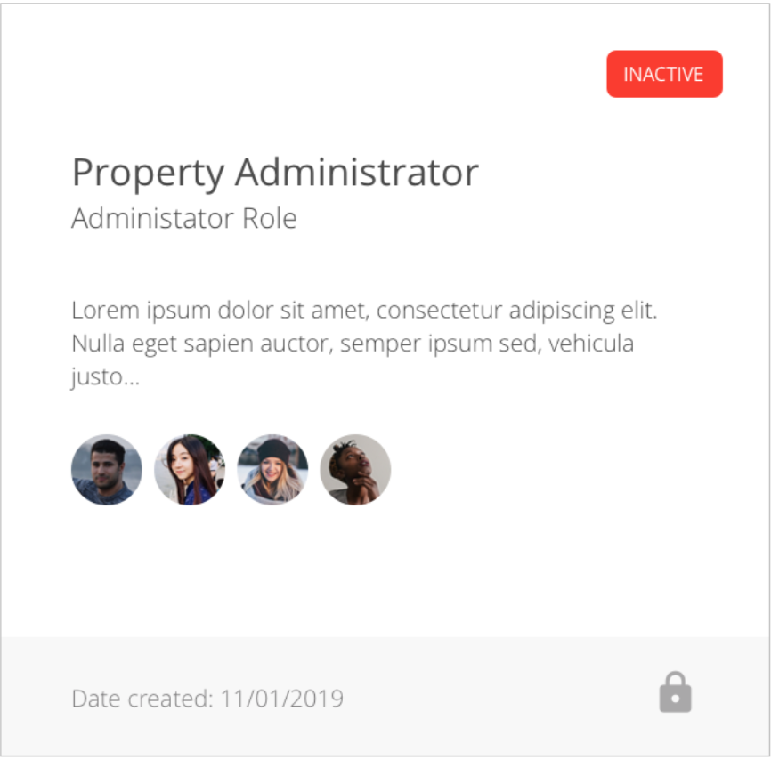

Link to my project here: https://eager-mclean-bf9d46.netlify.com/

## Expectations
- While we have provided you with an initial bootstrapped react app (based on create-react-app) you have creative license to change the initial setup to fit your preferred project structure 

- We do not expect you to complete the entire challenge. 
Ideally we would like candidates to spend 4 to 8 hours working on the exercise based on their availability and comfort level.
Please keep track of your overall time commitment so we can make sure to take it into account when reviewing your submission.

- While we don't expect you to complete the entire design we would like your progress to be visible when displayed on the screen.
Please try to focus on shipping "complete" pieces of the design as you would in a normal iterative manner to make reviewing the submission as easy as possible.

- We do not expect you to match the design exactly. 
Since we are not providing explicit requirements including break points for text wrapping you should feel free exercise some level creative license.

## Challenge
In this challenge you will implement a single page of an application using react and ES6.
You are free to utilize any libraries that you would like but you should be prepared to talk about your choices.

## Designs
Below is a complete design of the page that we would like you to start implementing.
The page is primarily comprised of the following elements:
- A static display title of "User Role Management"
- A search field that preforms full text search based on the title of the "role cards"
- A drop down for filtering roles based on status (selections should include 'Active', 'Inactive', and 'Active and Inactive')
- A button for adding new roles.
- A collection of "role cards" (more details below)

Below are a few designs for a "role card" based on different states.
A "role card" is comprised of the following elements.
- The roles name.
- The roles type.
- The roles description.
- A collection of images relating to the users associated to a role.
- An information on when the role was created
- If the role is editable both "Edit" and "Delete" buttons are present.
- If the role is not editable there should be an indicator showing that the role is not editable.
- If the role is not active there should be an indicator to demarcate it as "inactive"

## Data
We have provided a mock data set in the `resources` directory. 
The user_roles.json file is a mocked representation of the roles displayed on the design page (You do not have to use this data. You are welcome to create your own mock data if you would prefer).

## Questions
If you have questions regarding the design, data, or the challenge itself please feel free to reach out to your recruiter and we'll make sure to get you an answer ASAP. 

## Available Scripts

In the project directory, you can run:

### `npm start`

Runs the app in the development mode. 
Open [http://localhost:3000](http://localhost:3000) to view it in the browser.

The page will reload if you make edits. 
You will also see any lint errors in the console.

### `npm test`

Launches the test runner in the interactive watch mode. 
See the section about [running tests](https://facebook.github.io/create-react-app/docs/running-tests) for more information.

### `npm run build`

Builds the app for production to the `build` folder. 
It correctly bundles React in production mode and optimizes the build for the best performance.

The build is minified and the filenames include the hashes. 
Your app is ready to be deployed!
See the section about [deployment](https://facebook.github.io/create-react-app/docs/deployment) for more information.
